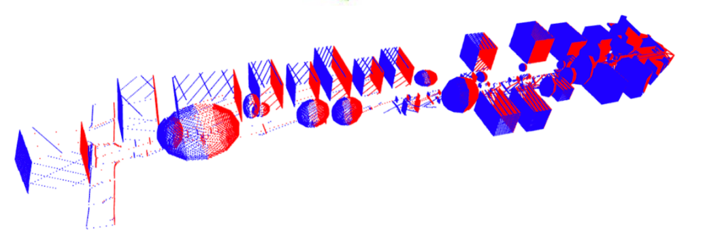
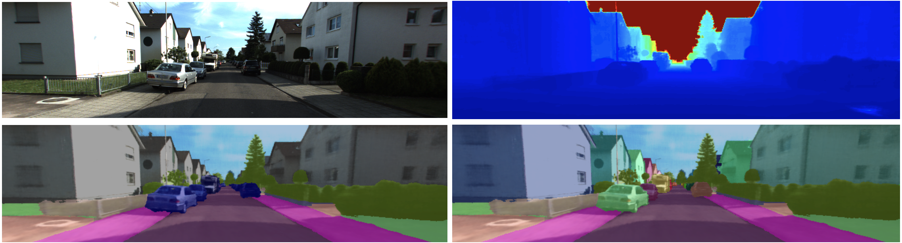

<div align="center">

<h1>Panoptic NeRF: 3D-to-2D Label Transfer for Panoptic Urban Scene Segmentation</h1>

<div>
    <a href='https://fuxiao0719.github.io/' target='_blank'>Xiao Fu</a><sup>1</sup>*&emsp;
    Shangzhan Zhang<sup>1</sup>*&emsp;
    Tianrun Chen<sup>1</sup>&emsp;
    Yichong Lu<sup>1</sup>&emsp;
    <a href='https://lanyunzhu.site/' target='_blank'>Lanyun Zhu</a><sup>2</sup>&emsp;
    <a href='https://xzhou.me/' target='_blank'>Xiaowei Zhou</a><sup>1</sup>&emsp;
    <a href='http://www.cvlibs.net/' target='_blank'>Andreas Geiger</a><sup>3</sup>&emsp;
    <a href='https://yiyiliao.github.io/' target='_blank'>Yiyi Liao</a><sup>1†</sup>
</div>
<div>
    <sup>1</sup>Zhejiang University&emsp;
    <sup>2</sup>Singapore University of Technology and Design&emsp;
    <sup>3</sup>University of Tübingen and MPI-IS
</div>
<div>
    *equal contribution&emsp;
    <sup>+</sup>corresponding author
</div>

<strong>3DV 2022 </strong>

<h4 align="center">
  <a href="https://fuxiao0719.github.io/projects/panopticnerf/" target='_blank'>[Project Page]</a> •
  <a href="https://www.cvlibs.net/publications/Fu2022THREEDV.pdf" target='_blank'>[Paper]</a> •
  <a href="https://www.cvlibs.net/publications/Fu2022THREEDV_supplementary.pdf" target='_blank'>[Supplementary]</a> •
  <a href="http://www.cvlibs.net/datasets/kitti-360/" target='_blank'>[Dataset]</a> •
  <a href="https://www.youtube.com/embed/5QKTeFLciWo" target='_blank'>[Video]</a> •
  <a href="https://fuxiao0719.github.io/projects/panopticnerf/images/poster.pdf" target='_blank'>[Poster]</a>
</h4>


</div>

## Updates
* [08/2022] Paper accepted to <a href="https://3dvconf.github.io/2022/" target='_blank'>3DV 2022</a>.
* [04/2022] Code released.
* [03/2022] <a href="http://arxiv.org/abs/2203.15224" target='_blank'>Paper</a> uploaded to arXiv. [](http://arxiv.org/abs/2203.15224)

## Installation
1. Create a virtual environment via `conda`. This environment is built on `RTX 3090` and can be modified manually.
    ```
    conda env create -f environment.yml
    conda activate panopticnerf
    ```

## Data Preparation
1. We evaluate our model on [KITTI-360](http://www.cvlibs.net/datasets/kitti-360/). Here we show the structure of a test dataset as follow. You can download it from [here](https://drive.google.com/file/d/1oJF8e5m4yPrRArn6EPmqXguIl-au2FnT/view?usp=sharing) and then put it into `$ROOT`. In the `datasets`, we additionally provide some test files on different scenes.
    ```
    ├── KITTI-360
      ├── 2013_05_28_drive_0000_sync
        ├── image_00
        ├── image_01
      ├── bbx_intersection
        ├── *_00.npz
        ├── *_01.npz
      ├── calibration
        ├── calib_cam_to_pose.txt
        ├── perspective.txt
      ├── data_3d_bboxes
      ├── data_poses
        ├── cam0_to_world.txt
        ├── poses.txt
      ├── pspnet
      ├── sgm
      ├── visible_id
    ```

    | file | Intro |
    | ------ | ------ |
    | `image_00/01` | stereo RGB images |
    | `pspnet` | 2D pseudo ground truth |
    | `sgm` | weak stereo depth supervision |
    | `visible_id` | per-frame bounding primitive IDs |
    | `data_poses` | system poses in a global Euclidean coordinate |
    | `calibration` | extrinsics and intrinsics of the perspective cameras |
    | `bbx_intersection` | ray-mesh intersections, containing depths between hitting points and camera origin, semantic label IDs and bounding primitive IDs|

2. Generate ray-mesh intersections (`bbx_intersection/*.npz`). The red dots and blue dots indicate where the rays hit into and out of the meshes, respectively. For the given test scene, `START=3353`, `NUM=64`.
    ```
    # image_00
    python mesh_intersection.py intersection_start_frame ${START} intersection_frames ${NUM} use_stereo False
    # image_01
    python mesh_intersection.py intersection_start_frame ${START} intersection_frames ${NUM} use_stereo True
    ```
  

3. Evaluate the origin of a scene (`center_pose`) and the distance from the origin to the furthest bounding primitive (`dist_min`). Then accordingly modify the `.yaml` file.
    ```
    python recenter_pose.py recenter_start_frame ${START} recenter_frames ${NUM}
    ```

## Training and Visualization
1. We provide the training code. Replace `resume False` with `resume True` to load the pretained model.
    ```
    python train_net.py --cfg_file configs/panopticnerf_test.yaml use_stereo True use_pspnet True use_depth True pseudo_filter True weight_th 0.05 resume False gpus '0,'
    ```

2. Render semantic map, panoptic map and depth map in a single forward pass, which takes around 16s per-frame on a single 3090 GPU. Please make sure to maximize the GPU memory utilization by increasing the size of the chunk to reduce inference time. Replace `use_stereo False` with `use_stereo True` to render the right views.
    ```
    python run.py --type visualize --cfg_file configs/panopticnerf_test.yaml use_stereo False
    ```
    
3. Visualize novel view appearance & label synthesis. Before rendering, select a frame and generate corresponding ray-mesh intersections with respect to its novel spiral poses, e.g. `SPIRAL_FRAME=3400`, `NUM=32`.
    ```
    python mesh_intersection_spiral_trajectory.py intersection_spiral_frame ${SPIRAL_FRAME} intersection_frames ${NUM} use_stereo False
    ```
    Then render results of the spiral trajectory. Feel free to change codes for rendering from arbitrary poses. 
    ```
    python run.py --type visualize --cfg_file configs/panopticnerf_test_spiral.yaml spiral_frame ${SPIRAL_FRAME} spiral_frame_num ${NUM} use_stereo False
    ```
    

## Evaluation
  ```
  ├── KITTI-360
    ├── gt_2d_semantics
    ├── gt_2d_panoptics
    ├── lidar_depth
  ```
1. Download the released [pretrained model](https://drive.google.com/drive/folders/1jd8eWfXDH7D09y4Ul1w7GKfTy3BqJZgk?usp=sharing) and put it to `$ROOT/data/trained_model/panopticnerf/panopticnerf_test/latest.pth`.

2. We provide some semantic & panoptic GTs and LiDAR point clouds for evaluation. The details of evaluation metrics can be found in the paper.
3. Eval mean intersection-over-union (mIoU).
  ```
  python run.py --type eval_miou --cfg_file configs/panopticnerf_test.yaml use_stereo False
  ```

4. Eval panoptic quality (PQ)
  ```
  sh eval_pq_test.sh
  ```
5. Eval depth with 0-100m LiDAR point clouds, where the far depth can be adjusted to evaluate the closer scene.
  ```
  python run.py --type eval_depth --cfg_file configs/panopticnerf_test.yaml use_stereo False max_depth 100.
  ```
6. Eval Multi-view Consistency (MC)
  ```
  python eval_consistency.py --cfg_file configs/panopticnerf_test.yaml use_stereo False consistency_thres 0.1
  ```
7.  The following table shows the detailed quantitative results with our pretrained models.

      |Scene ID|mIoU|Acc|PQ|SQ|RQ|
      |:-----:|:---:|:---:|:---:|:---:|:---:|
      |1538_1601|81.3|94.2|71.0|80.9|86.5|
      |1728_1791|79.6|92.4|62.5|75.0|81.9|
      |1908_1971|84.4|94.3|75.2|80.9|91.9|
      |3353_3416|83.2|95.2|70.8|81.3|85.4|

## Citation

```bibtex
@inproceedings{fu2022panoptic,
  title={Panoptic NeRF: 3D-to-2D Label Transfer for Panoptic Urban Scene Segmentation},
  author={Fu, Xiao and Zhang, Shangzhan and Chen, Tianrun and Lu, Yichong and Zhu, Lanyun and Zhou, Xiaowei and Geiger, Andreas and Liao, Yiyi},
  booktitle = {International Conference on 3D Vision (3DV)},
  year = {2022}
}
```
Copyright © 2022, Zhejiang University. All rights reserved. We favor any positive inquiry, please contact `lemonaddie0909@gmail.com`.